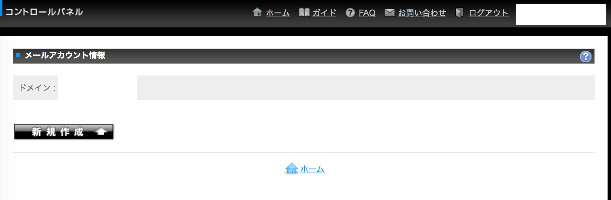
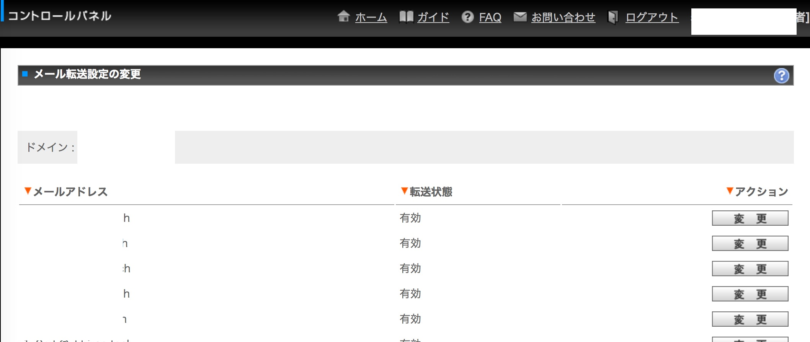

# chrome_extension
色々自動化を目指して開発中のサンプル。

## e_syugyo

入館システムから自動入力される打刻時間から、Chrome拡張を使って就業時間と平日休憩(1.00)を入力する。このページで[ d a k o k u Enter ]の隠しコマンドでdom操作が発火する。

### 技術
* スクレイピング
* dom操作

### Screenshot	

## create_mail_account
お名前コムでメールアカウントを自動で作成する。1つずつ作成するしかないのでリクエストを全自動にした。

### 技術
* 対応するURLに反応
* dom操作と自動リクエスト
* ランダム5文字の文字列 @ ドメイン

### Screenshot	

## mail_redirect
すべてのメールアドレスにリダイレクト先をつける。全自動。

### 技術
* dom操作と自動リクエスト

### Screenshot	

## その他
auto_form  
dom  
sample  

.
